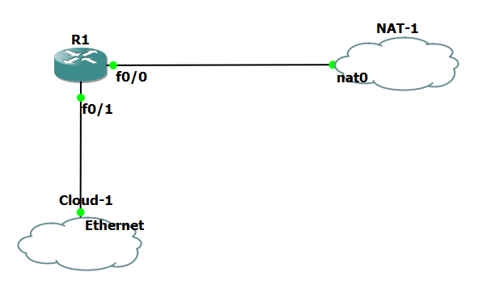

# Building a with gns3 virtual_router

*GNS3 set-up*

## SETUP For Virtual router
* Make sure your set up is the same as the above picture with same interafces
* This is virtual router setup that allows creation of a private network with an exposed network interface.
* With this one can route traffic from the outside world through the virtual router to the internet
* copy and paste commands from the script to your router in GNS3
* copy and paste commands from the script to the host
